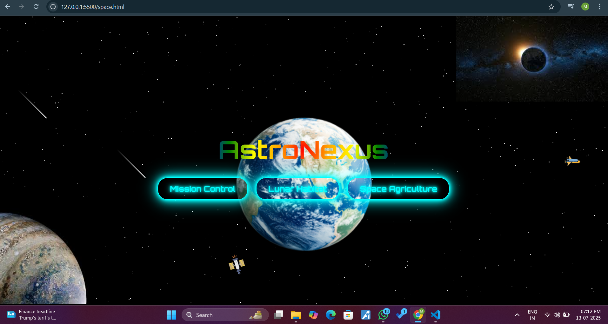
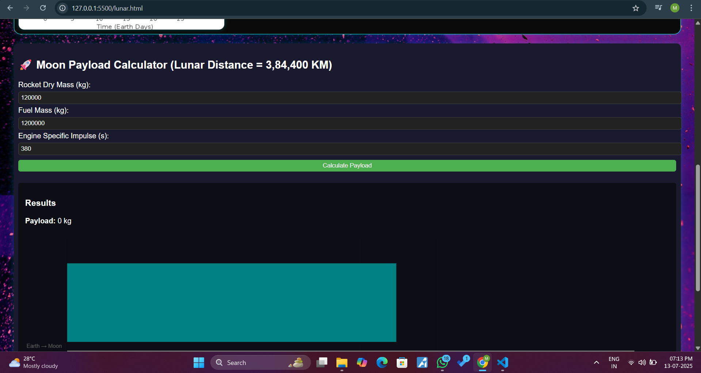

# AstroNexus-Spaceproject-1-
A space project providing information about sapce,space agriculture,lunar habitat mission control, different levels and many more exiting things

AstroNexus is an interactive web-based simulation platform designed to explore futuristic space missions and lunar sustainability. It features three interconnected modules:

1 Mission Control – Monitor satellite systems, control mission events, and analyze telemetry.
2 Space Agriculture – Visualize crop health, manage space-farm resources, and simulate plant growth using telemetry graphs.
3 Lunar Habitat – Simulate sustainable living on the Moon with resource calculators, environmental data

## Technologies Used
A web-based simulation and dashboard for space-themed content. Built using HTML, CSS, and JavaScript,leaftlet,js,chart.js,MATLAB.
## Features
- Animated backgrounds
- Satellite orbit visuals
- Mission control interface
- Lunar Habitat
- Space Agriculture
- Charts,graphs for visuilization
- Maps
## Mission Control
- UI background
- Represent data through graphs,charts
- Gives information about upcomming mission
- Twinking,spacecraft,satellite,earth revolution by java script , css
## Lunar habitat
- Gives information about lunar
- Temperature calculation of day/night through MATLAB
- Payload calculation and bar graph representation by MATLAB.javascript,CSS,Charts.js
## Space Agriculture
- UI interface
- User interactive
- GIves information about group growing in space showing differents need
- Map representation
## Screenshorts

  
  
   

### 📂 Folder Structure
- 📂images
- agriculture.html
- agriculture.css
- agriculture.javascript
- lunar.html
- lunar.css
- lunar.javascript
- mission.html
- mission.css
- mission.javascript
- space.html (homepage)
- space.css
- space.javascript
